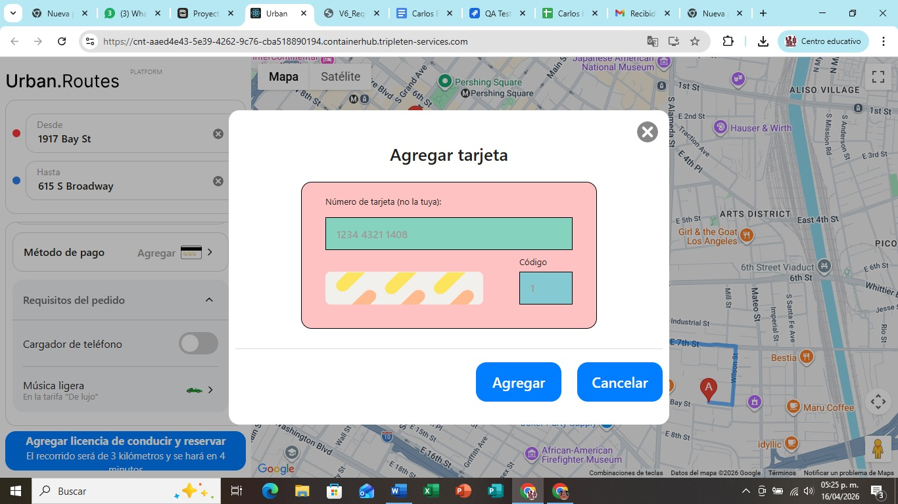
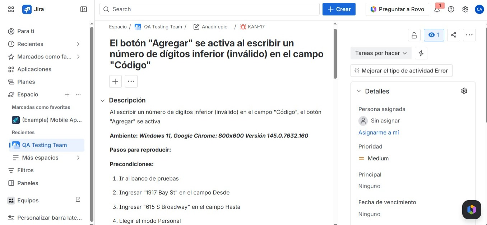
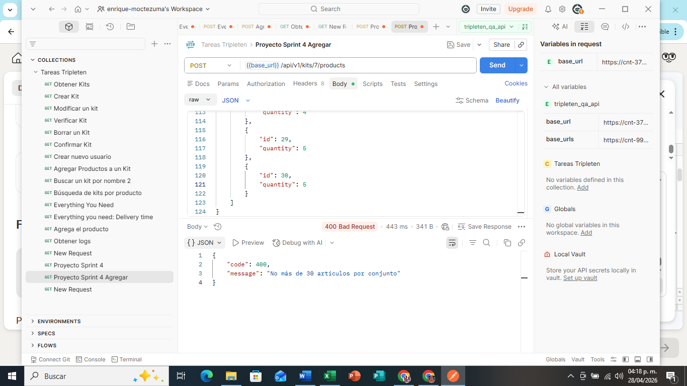

# Hola, soy Carlos Enrique Moctezuma Avalos 👋

## Sobre mí

Soy Ingeniero Mecatrónico en transición hacia el área de **QA Engineering**. Actualmente me estoy formando en pruebas manuales, API Testing, documentación de bugs y validación de aplicaciones web mediante el Bootcamp de QA Engineering de TripleTen.

Cuento con experiencia en metrología, documentación técnica, manejo de datos en Excel, atención al cliente y procesos de calidad. Me interesa aplicar mi pensamiento analítico, atención al detalle y enfoque en mejora continua dentro del aseguramiento de calidad de software.

## Áreas de interés

- QA Engineering
- Manual Testing
- API Testing
- Web Testing
- Postman
- JIRA
- JSON
- Excel
- JavaScript

## Proyectos destacados

### Pruebas de Aplicaciones Web | Bootcamp QA Engineering, TripleTen

**Tecnologías utilizadas:** JIRA, Excel, JSON, JavaScript

Diseñé y ejecuté casos de prueba manuales para validar el funcionamiento de una aplicación web, revisando la interfaz, navegación, comportamiento de funciones y cumplimiento de requerimientos.

Identifiqué y documenté bugs encontrados durante las pruebas, incluyendo errores críticos difíciles de detectar. Utilicé JIRA para reportar defectos, organizar incidencias y dar seguimiento a los hallazgos.

Este proyecto me permitió fortalecer habilidades en pruebas manuales, análisis funcional, documentación de errores, validación de requerimientos y trabajo con metodologías ágiles.

*Caso de prueba negativo en Urban Routes, donde se ingresó un número de tarjeta bancaria con menos dígitos de los requeridos. El sistema aceptó la solicitud cuando debía rechazarla, por lo que el error fue documentado y reportado en JIRA.*

*Bug documentado en JIRA con la información requerida para su seguimiento y corrección.*

### Pruebas de API con Postman | Bootcamp QA Engineering, TripleTen

**Tecnologías utilizadas:** Postman, JSON, JIRA, Excel

Realicé pruebas manuales de API utilizando Postman, validando endpoints, respuestas del servidor, códigos de estado HTTP y comportamiento de las solicitudes según los requerimientos establecidos.

Analicé respuestas en formato JSON para identificar errores críticos, fallas de comportamiento e inconsistencias en los datos. Documenté los hallazgos para facilitar el seguimiento y corrección de incidencias.

Este proyecto me ayudó a reforzar conocimientos en API Testing, metodología HTTP, validación de servicios, análisis de errores y documentación de pruebas.

*Caso de prueba realizado en Postman para validar límites de productos permitidos en una solicitud.*

*Bug documentado en JIRA con la información requerida para su seguimiento y corrección.*

## Herramientas y tecnologías

- Postman
- JIRA
- Excel
- JSON
- JavaScript
- GitHub

## Actualmente aprendiendo

- Diseño y ejecución de casos de prueba
- Reporte de bugs
- Validación de APIs
- Documentación de pruebas
- Flujo de trabajo en proyectos QA

## Contacto

- LinkedIn: www.linkedin.com/in/enrique-moctezuma
- Correo: carlos.moctezuma@iest.edu.mx
